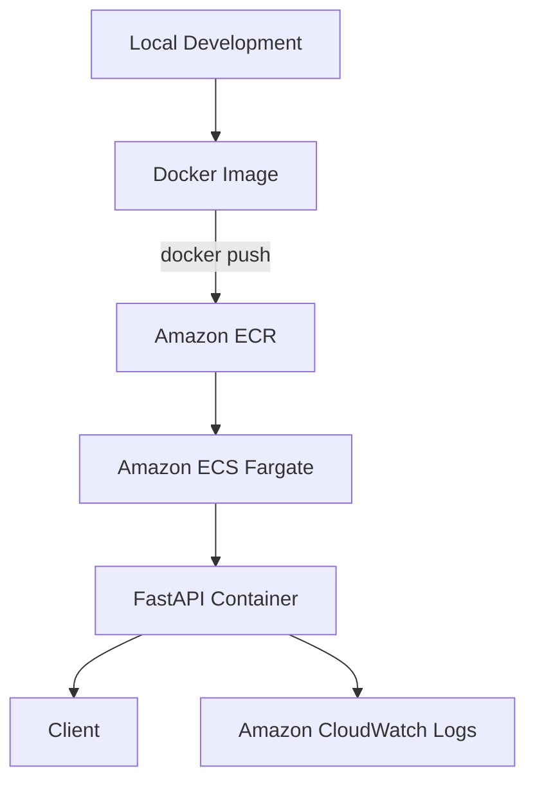

# SRE Portfolio

FastAPIで作成したシンプルなWeb APIを題材に、Dockerによるコンテナ化とAWS上へのデプロイを実践するプロジェクトです。

単にアプリケーションを開発するだけでなく、今後はInfrastructure as Code、CI/CD、監視、負荷試験などを導入し、サービスを安定して運用するための仕組みを段階的に構築していきます。

## アーキテクチャ



現在は以下の構成でAWS上にデプロイしています。

- FastAPI
- Docker
- Amazon ECR
- Amazon ECS / Fargate
- Amazon CloudWatch Logs
- Security Group

## 特徴

以下のAPIを実装しています。

### `GET /`

APIの動作確認用エンドポイントです。

```json
{
  "message": "SRE Portfolio API"
}
```

### `GET /health`

サービスの正常性を確認するためのヘルスチェック用エンドポイントです。

```json
{
  "status": "ok"
}
```

### `GET /slow`

意図的にレスポンスを遅延させるエンドポイントです。

今後、負荷試験や監視の検証に利用する予定です。

---

## 技術スタック

### アプリケーション

- Python
- FastAPI
- Uvicorn

### コンテナ

- Docker

### AWS

- Amazon ECR
- Amazon ECS
- AWS Fargate
- Amazon CloudWatch Logs
- Security Group

---

## ローカル環境立ち上げ

### 1. Clone

```bash
git clone <repository-url>
cd sre-portfolio
```

### 2. 仮想環境作成

```bash
python3 -m venv .venv
source .venv/bin/activate
```

### 3. 依存関係

```bash
pip install -r requirements.txt
```

### 4. FastAPI起動

```bash
uvicorn app.main:app --reload
```

Access:

```text
http://127.0.0.1:8000
```

API documentation:

```text
http://127.0.0.1:8000/docs
```

---

## dockerで起動

Build the Docker image.

```bash
docker build -t sre-portfolio .
```

Run the container.

```bash
docker run --name sre-api -p 8000:8000 sre-portfolio
```

Access the health check endpoint.

```text
http://127.0.0.1:8000/health
```

---

## AWSへデプロイ

DockerイメージをAmazon ECRへPushし、Amazon ECS Fargate上でコンテナを実行しています。

```text
FastAPI
   ↓
Docker Image
   ↓
Amazon ECR
   ↓
Amazon ECS Fargate
   ↓
FastAPI Container
```

ECS TaskにはPublic IPを割り当て、Security GroupによってFastAPIが使用するTCP 8000番ポートへのアクセスを制御しています。

アプリケーションの実行ログはAmazon CloudWatch Logsから確認できます。

---

## 学んだこと

このプロジェクトを通じて、以下を実践しました。

- FastAPIを利用したWeb APIの構築
- Dockerによるアプリケーションのコンテナ化
- Docker ImageとContainerの関係
- Amazon ECRへのDocker Imageの登録
- Amazon ECS / Fargateによるコンテナ実行
- Security Groupによる通信制御
- Public IPとポートを利用した外部アクセス
- CloudWatch Logsを利用したアプリケーションログの確認
- AWSリソースを利用しない際に停止するなど、クラウドコストを意識した運用

---

## 今後の実装

今後、以下を実装予定です。

- [ ] TerraformによるAWSインフラのコード化
- [ ] GitHub ActionsによるCI/CD
- [ ] CloudWatch Metrics / Alarmによる監視
- [ ] 負荷試験
- [ ] 障害発生時の原因調査
- [ ] 負荷試験結果をもとにした構成改善
- [ ] SLO / SLIの検討

最終的には、

```text
Code Push
   ↓
CI/CD
   ↓
Docker Build
   ↓
Amazon ECR
   ↓
Amazon ECS
   ↓
Monitoring
   ↓
Failure Detection
   ↓
Improvement
```

という一連の運用を構築し、サービスの信頼性と運用効率を改善することを目標としています。

## 目的

SRE（Site Reliability Engineering）に興味を持ったことをきっかけに、アプリケーションを「作る」だけでなく、

- どのようにデプロイするか
- どのように状態を把握するか
- どのように手作業を減らすか
- 障害や負荷にどう対応するか

といった運用・信頼性の観点を実践的に学ぶために制作しています。

## デプロイ先のURL
http://54.238.24.160:8000/
